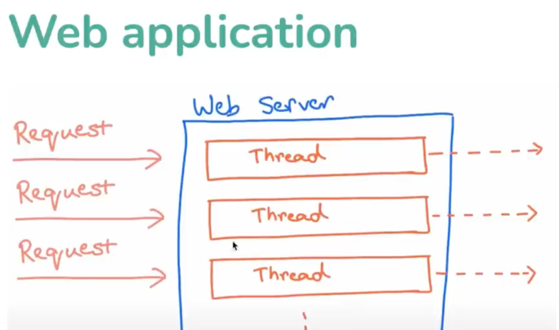
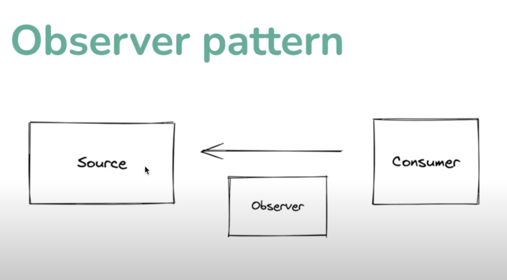
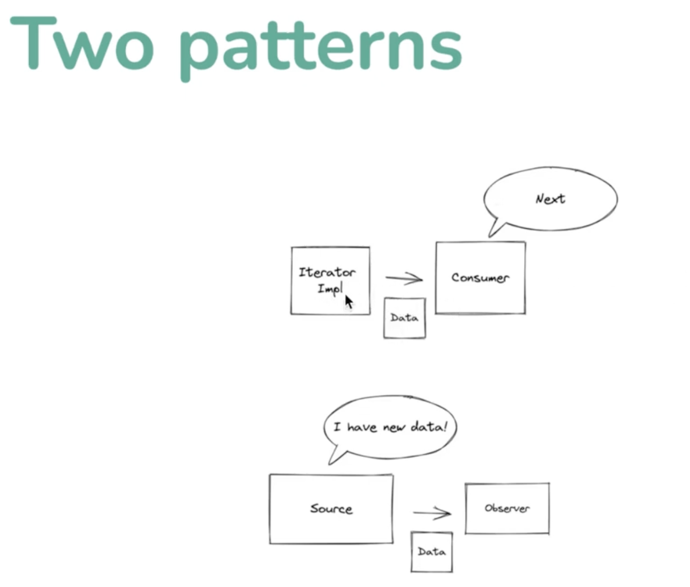
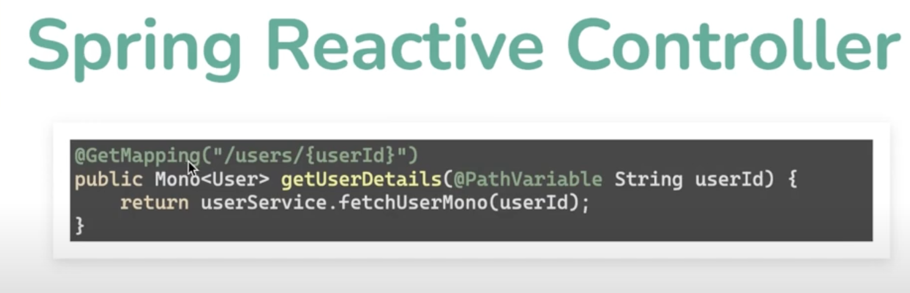
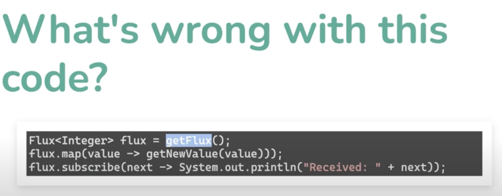

# What is Reactive Programming

## Traditional Use cases of Reactive Programming

- User Events
    - When user Clicks on a Button
        - (We Wire in a callback)
    - When I/O Response

React to Something. When User Clicks this button, run this function

> Why do we care about Reactive Programming in Server Side Java Development ?

### Server Side Web Development Flow

- Request Comes in
- We do processing
- We return the response

Each Request by itself is not reactive. Its Synchronous

## A Case for Reactive Programming

Modern Application Development Involves

- High Data Scale
- High Usage Scale
- Cloud Based Costs

> How do we Scale up ?

- Vertical Scaling
- Horizontal Scaling

Before Scaling Optimizing Code for Resource Utilization

> Problematic Code

```java
@GetMapping("/users/{userId}")
/*
 * Unnecessarily Sequential Calls
 */
public User getuserDetails(@PathVariable String userId) {
    User user = userService.getUser(userId); // Blocking Servlet Thread
    UserPreferences preferences = userPreferencesService.getPreferences(userId); // Blocking Servlet Thread
    user.setPreferences(preferences);
    return user;
}
```



> Traditional Way of REST Services would result in Thread Idling and Cost of Wasted Hardware

## Spoilt Backend Developers

> Don't Usually think about Async Programming

- It's a Single Request
- Multiple Simultaneous Users are abstracted out
- Delays abstracted out
- We pay with Sequential Blocking Operations
- We pay with Idling threads

### Leverage Concurrency APIs in Java : CompletableFuture

- Call UserService
- Call UserProfileService in parallel
- When Both return Merge the Data Structures
- Return the Merged Object

```java
import java.util.concurrent.CompletableFuture;


@GetMapping("/users/{userId}")
/*
 * Unnecessarily Sequential Calls
 */
public User getuserDetails(@PathVariable String userId) {
    CompletableFuture<User> userAsync = CompletableFuture.supplyAsync(() -> userService.getUser(userId));
    CompletableFuture<UserPreferences> preferencesAsync = CompletableFuture.supplyAsync(
            () -> userPreferencesService.getPreferences(userId));

    CompletableFuture<Void> bothFutures = CompletableFuture.allOf(userAsync, preferencesAsync);

    // Here we have to wait for Futures to Resolve to Return 
    bothFutures.join();
    User user = userAsync.join();
    UserPreferences preferences = preferencesAsync.join();
    user.setPreferences(preferences);
    return user;
}
```

## Reactive Programming

```java
import reactor.core.publisher.Mono;


@GetMapping("/users/{userId}")
/*
 * Unnecessarily Sequential Calls
 */
public Mono<User> getuserDetails(@PathVariable String userId) {
    return userService.getUser(userId)
            .zipWith(userPreferencesService.getPreferences(userId))
            .map(tuple -> {
                User user = tuple.getT1();
                UserPreferences prefs = tuple.getT2();
                user.setPreferences(pref);
                return user;
            });
}
```

- Much Simpler than manual concurrent way.
- Few reusable declarative functions
- Combine and reuse in powerful ways

## Java Collections Streams Detour

### Java Streams

- Represent a Sequence of Data
- Focus on Computations
- vs Collections which focus on Storage
- Internal Iteration

#### Stream Operation

- map
- filter
- flatMap
- findFirst 


## Design Patterns 

### Iterator Pattern 

Iterator Pattern is a Behavioral Pattern that lets you traverse elements of a collection without exposing its underlying representation (list, stack, tree, etc.).

Iterator -> Consumer

> Checkout the Additional Video on Iterator Pattern

### Observer Pattern

Observer Pattern is a Behavioral Pattern that lets you define a subscription mechanism to notify multiple objects about any events that happen to the object they're observing.

Subject maintains a list of its dependents, called observers, and notifies them of a state change, usually by calling one of their methods.



## Two Patterns 



Iterator Pattern is about Pulling Data
Observer Pattern is about Pushing Data

### When to use Which Pattern

```
Iterator Pattern
myList.forEach(item -> {
    // Do Something
});

Observer Pattern
Listen to Mouse Clicks and Print Each Event 
clicksChannel.addObserver(event -> System.out.println(event));
```

### Chain Operations

```
myList.filter(item -> item != null)
    .forEach(item -> System.out.println(item));

clicksChannel.filter(event -> event != null)
    .forEach(event -> System.out.println(event));
```

### Reactive Programming

```java
clicksChannel
    .filter(event -> event != null)
    .subscribe(event -> System.out.println(event));
```

## Assembly Line Analogy

- Assembly Line
    - Each Worker does a specific task
    - Items come over time
 

 ## How do access a list of published events 

```
List<Integer> list = ReactiveSources.intNumbersFlux().toStream().toList(); // This is a Blocking Operation
System.out.println(list);

```

## Reactive Programming in Java

### Three Abstractions 

- Publisher
- Subscriber
- Subscription

Use Interfaces to leverage the Reactive Programming Model

### What we will Use 

- Project Reactor
    - Mono
    - Flux

Flux represents 0 to N items
Mono represents 0 or 1 item

## Mono Vs Flux 

- Mono
    - 0 or 1 item
    - Success or Error

- Flux
  - 0 to N items
  - Success or Error

## What's Coming ? 

Both Flux and Mono have completion events. 

- An Item 
- A Complete Event 
- A Failure Event

Complete Event and Failure Event are Terminal Events. It means that the Stream is Closed


## Whats the Point ? 

> mono.blok() is a Blocking Operation

### Reactive all the way 

In the restaurant analogy.  Customer -> Cahier -> Cook 

The ideal place the it should be blocking is the Customer and no on else. Because, Maybe the Cashier can attend to other pickup orders while the Customer is waiting for the order to be prepared. 

Netty is a Non Blocking Server. It's Reactive all the way. It even handles the HTTP Requests reactively. Kinda like Event Loop in NodeJS

> Netty Servers can take 100K requests per second.




## Operators

- Take: Take the first n elements
- Skip: Skip the first n elements
- Filter: Filter the values
- Map: Transform the values
- FlatMap: Transform the values
- ConcatMap: Preserve Order
- Merge: Combine the values from multiple sources
- Zip: Combine the values from multiple sources
- CombineLatest: Combine the latest values from multiple sources


## Return Values 

### Don't forget to Chain the Operators 
